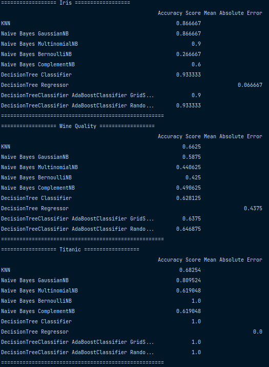

# Data Multiple Predictor

## Description
We're going to use some models to predict the **Datasets** and show the predictions results in a table.

## Models to be implemented
We're going to use the following models:
1. KNN
2. Naive Bayes
    1. Gaussian
    2. Multinomial
    3. Bernoulli
    4. Complement

## Datasets
We're going to use the following datasets:
1. Iris Sklearn 
2. Wine Quality https://www.kaggle.com/datasets/nareshbhat/wine-quality-binary-classification
3. Titanic https://www.kaggle.com/datasets/heptapod/titanic (Modified)

## How to run
1. Clone the repository
2. Install the requirements
3. Run the main.py file
4. Check the results in the terminal

## Results
The results are shown in the following table:
